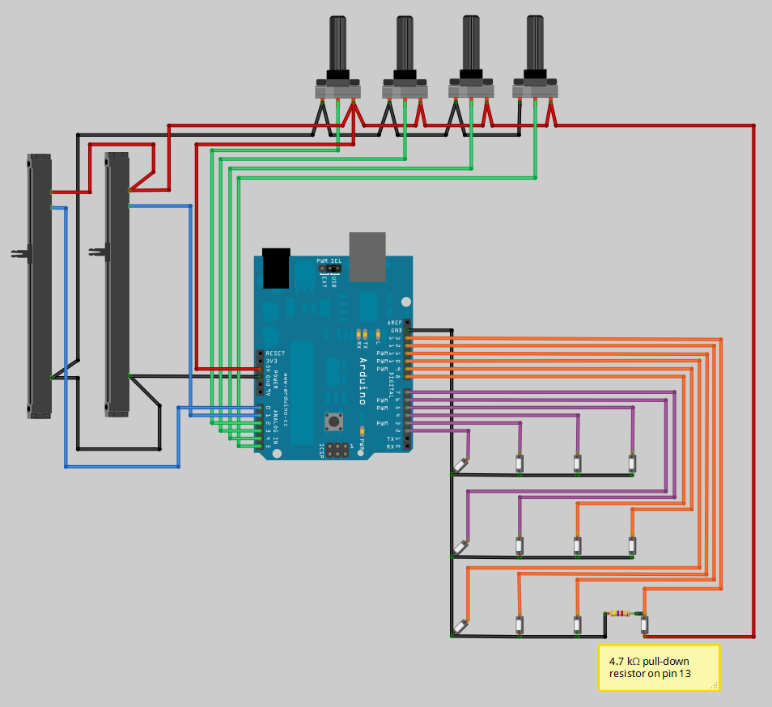

# MIDI Controller
Allow me introduce you to my latest creation - the MIDI Controller! This creation fuses technology and music, allowing musicians to craft amazing melodies with ease. The journey of building this was rather strenuous at times- I faced challenges left and right, but through patience and learning from failures, I conquered them all. Now, I'm excited to share this musical adventure with you and show you the magic that comes alive when creativity meets perseverance. Without further ado, let's explore the wonders of my MIDI controller together!
You should comment out all portions of your portfolio that you have not completed yet, as well as any instructions:
```HTML 
<!--- This is an HTML comment in Markdown -->
<!--- Anything between these symbols will not render on the published site -->
```

| **Engineer** | **School** | **Area of Interest** | **Grade** |
|:--:|:--:|:--:|:--:|
| Daniyal R | Cherry Hill East High School | Mechanical Engineering | Incoming Junior

**Replace the BlueStamp logo below with an image of yourself and your completed project. Follow the guide [here](https://tomcam.github.io/least-github-pages/adding-images-github-pages-site.html) if you need help.**


```  
# Final Milestone

**Don't forget to replace the text below with the embedding for your milestone video. Go to Youtube, click Share -> Embed, and copy and paste the code to replace what's below.**

<iframe width="560" height="315" src="https://www.youtube.com/embed/F7M7imOVGug" title="YouTube video player" frameborder="0" allow="accelerometer; autoplay; clipboard-write; encrypted-media; gyroscope; picture-in-picture; web-share" allowfullscreen></iframe>

For your final milestone, explain the outcome of your project. Key details to include are:
- What you've accomplished since your previous milestone
- What your biggest challenges and triumphs were at BSE
- A summary of key topics you learned about
- What you hope to learn in the future after everything you've learned at BSE

```

# Second Milestone

**Don't forget to replace the text below with the embedding for your milestone video. Go to Youtube, click Share -> Embed, and copy and paste the code to replace what's below.**

<iframe width="560" height="315" src="https://www.youtube.com/embed/L33O_OWwjb8" title="YouTube video player" frameborder="0" allow="accelerometer; autoplay; clipboard-write; encrypted-media; gyroscope; picture-in-picture; web-share" allowfullscreen></iframe>

For your second milestone, explain what you've worked on since your previous milestone. You can highlight:
- Technical details of what you've accomplished and how they contribute to the final goal
- What has been surprising about the project so far
- Previous challenges you faced that you overcame
- What needs to be completed before your final milestone 

# First Milestone

**Don't forget to replace the text below with the embedding for your milestone video. Go to Youtube, click Share -> Embed, and copy and paste the code to replace what's below.**

<iframe width="560" height="315" src="https://www.youtube.com/embed/kDBGw-b-g0M" title="YouTube video player" frameborder="0" allow="accelerometer; autoplay; clipboard-write; encrypted-media; gyroscope; picture-in-picture; web-share" allowfullscreen></iframe>

For your first milestone, describe what your project is and how you plan to build it. You can include:
- An explanation about the different components of your project and how they will all integrate together
- Technical progress you've made so far
- Challenges you're facing and solving in your future milestones
- What your plan is to complete your project

# Schematics 
Here's where you'll put images of your schematics. [Tinkercad](https://www.tinkercad.com/blog/official-guide-to-tinkercad-circuits) and [Fritzing](https://fritzing.org/learning/) are both great resoruces to create professional schematic diagrams, though BSE recommends Tinkercad becuase it can be done easily and for free in the browser. 


# Code
Here's where you'll put your code. The syntax below places it into a block of code. Follow the guide [here]([url](https://www.markdownguide.org/extended-syntax/)) to learn how to customize it to your project needs. 


```c++
// MIDI Controller code for reading all of the Arduino's digital and analogue inputs
// and sending them as MIDI messages to the host PC.

#if defined(__AVR_ATmega1280__) || defined(__AVR_ATmega2560__)
#define ARDUINO_MEGA
#elif defined(__AVR_AT90USB646__)
#define TEENSY_PLUS_PLUS
#elif defined(__AVR_ATmega32U4__)
#define TEENSY_2
#elif defined(__AVR_AT90USB1286__)
#define TEENSY_PLUS_PLUS_2
#else
#define ARDUINO
#endif

//#define DEBUG

// Uncomment this line to enable outputs corresponding to the MIDI Fighter so MF mappings can be used in Traktor.
//#define MIDI_FIGHTER

//#define FASTADC
// defines for setting and clearing register bits
#ifndef cbi
#define cbi(sfr, bit) (_SFR_BYTE(sfr) &= ~_BV(bit))
#endif
#ifndef sbi
#define sbi(sfr, bit) (_SFR_BYTE(sfr) |= _BV(bit))
#endif

// MIDI mapping taken from http://www.nortonmusic.com/midi_cc.html
#define MIDI_CC_MODULATION 0x01
#define MIDI_CC_BREATH 0x02
#define MIDI_CC_VOLUME 0x07
#define MIDI_CC_BALANCE 0x08
#define MIDI_CC_PAN 0x0A
#define MIDI_CC_EXPRESSION 0x0B
#define MIDI_CC_EFFECT1 0x0C
#define MIDI_CC_EFFECT2 0x0D

#define MIDI_CC_GENERAL1 0x0E
#define MIDI_CC_GENERAL2 0x0F
#define MIDI_CC_GENERAL3 0x10
#define MIDI_CC_GENERAL4 0x11
#define MIDI_CC_GENERAL5 0x12
#define MIDI_CC_GENERAL6 0x13
#define MIDI_CC_GENERAL7 0x14
#define MIDI_CC_GENERAL8 0x15
#define MIDI_CC_GENERAL9 0x16
#define MIDI_CC_GENERAL10 0x17
#define MIDI_CC_GENERAL11 0x18
#define MIDI_CC_GENERAL12 0x19
#define MIDI_CC_GENERAL13 0x1A
#define MIDI_CC_GENERAL14 0x1B
#define MIDI_CC_GENERAL15 0x1C
#define MIDI_CC_GENERAL16 0x1D
#define MIDI_CC_GENERAL17 0x1E
#define MIDI_CC_GENERAL18 0x1F

#define MIDI_CC_GENERAL1_FINE 0x2E
#define MIDI_CC_GENERAL2_FINE 0x2F
#define MIDI_CC_GENERAL3_FINE 0x30
#define MIDI_CC_GENERAL4_FINE 0x31
#define MIDI_CC_GENERAL5_FINE 0x32
#define MIDI_CC_GENERAL6_FINE 0x33
#define MIDI_CC_GENERAL7_FINE 0x34
#define MIDI_CC_GENERAL8_FINE 0x35
#define MIDI_CC_GENERAL9_FINE 0x36
#define MIDI_CC_GENERAL10_FINE 0x37
#define MIDI_CC_GENERAL11_FINE 0x38
#define MIDI_CC_GENERAL12_FINE 0x39
#define MIDI_CC_GENERAL13_FINE 0x3A
#define MIDI_CC_GENERAL14_FINE 0x3B
#define MIDI_CC_GENERAL15_FINE 0x3C
#define MIDI_CC_GENERAL16_FINE 0x3D
#define MIDI_CC_GENERAL17_FINE 0x3E
#define MIDI_CC_GENERAL18_FINE 0x3F

#define MIDI_CC_SUSTAIN 0x40
#define MIDI_CC_REVERB 0x5B
#define MIDI_CC_CHORUS 0x5D
#define MIDI_CC_CONTROL_OFF 0x79
#define MIDI_CC_NOTES_OFF 0x78

#define NOTE_C0 0x00 // 0
#define NOTE_C1 0x12 // 18
#define NOTE_C2 0x24 // 36

#if defined(ARDUINO_MEGA)
  // Number of digital inputs. Can be anywhere from 0 to 68.
  #define NUM_DI 52
  // Number of analogue inputs. Can be anywhere from 0 to 16.
  #define NUM_AI 16
#elif defined(TEENSY_PLUS_PLUS)
  // Number of digital inputs. Can be anywhere from 0 to 46.
  #define NUM_DI 38
  // Number of analogue inputs. Can be anywhere from 0 to 8.
  #define NUM_AI 8
#elif defined(TEENSY_2)
  // Number of digital inputs. Can be anywhere from 0 to 25.
  #define NUM_DI 13
  // Number of analogue inputs. Can be anywhere from 0 to 12.
  #define NUM_AI 12
#elif defined(TEENSY_PLUS_PLUS_2)
  // Number of digital inputs. Can be anywhere from 0 to 46.
  #define NUM_DI 38
  // Number of analogue inputs. Can be anywhere from 0 to 8.
  #define NUM_AI 8
#else
  // Number of digital inputs. Can be anywhere from 0 to 18.
  #define NUM_DI 12
  // Number of analogue inputs. Can be anywhere from 0 to 6.
  #define NUM_AI 6
#endif


#if defined(MIDI_FIGHTER) && defined(ARDUINO)
  #define MIDI_CHANNEL 3
  // First note, starting from lower left button
  #define NOTE NOTE_C2
  // When mapping to a MIDI Fighter we need to skip a row of buttons. Set this from 0-3 to define which row to skip.
  // Rows are ordered from bottom to top (same as the MIDI Fighter's button layout).
  #define SKIP_ROW 2
  // This pin order corresponds to the bottom left button being zero, increasing by one as we move from left to right, bottom to top
  // 8  9 10 11
  // 4  5  6  7
  // 0  1  2  3
  // This array size must match NUM_DI above.
  #define DIGITAL_PIN_ORDER 10, 11, 12, 13, 6, 7, 8, 9, 2, 3, 4, 5
#else
  #define MIDI_CHANNEL 1
  // First note, starting from upper left button
  #define NOTE NOTE_C0
  // This pin order corresponds to the top left button being zero, increasing by one as we move from left to right, top to bottom
  // 0  1  2  3
  // 4  5  6  7
  // 8  9  10 11
  // This array size must match NUM_DI above.
  #if defined(ARDUINO_MEGA)
    #define DIGITAL_PIN_ORDER 2, 3, 4, 5, 6, 7, 8, 9, 10, 11, 12, 13, 14, 15, 16, 17, 18, 19, 20, 21, 22, 23, 24, 25, 26, 27, 28, 29, 30, 31, 32, 33, 34, 35, 36, 37, 38, 39, 40, 41, 42, 43, 44, 45, 46, 47, 48, 49, 50, 51, 52, 53
  #elif defined(TEENSY_PLUS_PLUS)
    #define DIGITAL_PIN_ORDER 0, 1, 2, 3, 4, 5, 6, 7, 8, 9, 10, 11, 12, 13, 14, 15, 16, 17, 18, 19, 20, 21, 22, 23, 24, 25, 26, 27, 28, 29, 30, 31, 32, 33, 34, 35, 36, 37
  #elif defined(TEENSY_2)
    #define DIGITAL_PIN_ORDER 0, 1, 2, 3, 4, 5, 6, 7, 8, 9, 10, 11, 12
  #elif defined(TEENSY_PLUS_PLUS_2)
    #define DIGITAL_PIN_ORDER 0, 1, 2, 3, 4, 5, 6, 7, 8, 9, 10, 11, 12, 13, 14, 15, 16, 17, 18, 19, 20, 21, 22, 23, 24, 25, 26, 27, 28, 29, 30, 31, 32, 33, 34, 35, 36, 37
  #else
    #define DIGITAL_PIN_ORDER 2, 3, 4, 5, 6, 7, 8, 9, 10, 11, 12, 13
  #endif
#endif

#if defined(ARDUINO_MEGA)
  #define ANALOGUE_PIN_ORDER A0, A1, A2, A3, A4, A5, A6, A7, A8, A9, A10, A11, A12, A13, A14, A15
#elif defined(TEENSY_PLUS_PLUS)
  #define ANALOGUE_PIN_ORDER 0, 1, 2, 3, 4, 5, 6, 7
#elif defined(TEENSY_2)
  #define ANALOGUE_PIN_ORDER 0, 1, 2, 3, 4, 5, 6, 7, 8, 9, 10, 11
#elif defined(TEENSY_PLUS_PLUS_2)
  #define ANALOGUE_PIN_ORDER 0, 1, 2, 3, 4, 5, 6, 7
#else
  #define ANALOGUE_PIN_ORDER A0, A1, A2, A3, A4, A5
#endif

#if defined(TEENSY_PLUS_PLUS) || defined(TEENSY_2) || defined(TEENSY_PLUS_PLUS_2)
  #define LED_PIN PIN_D6
#else
  #define LED_PIN 13
#endif

#define MIDI_CC MIDI_CC_GENERAL1

// Comment this line out to disable button debounce logic.
// See http://arduino.cc/en/Tutorial/Debounce on what debouncing is used for.
#define DEBOUNCE
// Debounce time length in milliseconds
#define DEBOUNCE_LENGTH 2

// Comment this line out to disable analogue filtering
#define ANALOGUE_FILTER
// A knob or slider movement must initially exceed this value to be recognised as an input. Note that it is
// for a 7-bit (0-127) MIDI value.
#ifdef FASTADC
#define FILTER_AMOUNT 3
#else
#define FILTER_AMOUNT 2
#endif
// Timeout is in microseconds
#define ANALOGUE_INPUT_CHANGE_TIMEOUT 250000

// Array containing a mapping of digital pins to channel index.
byte digitalInputMapping[NUM_DI] = {DIGITAL_PIN_ORDER};

// Array containing a mapping of analogue pins to channel index. This array size must match NUM_AI above.
byte analogueInputMapping[NUM_AI] = {ANALOGUE_PIN_ORDER};

// Contains the current state of the digital inputs.
byte digitalInputs[NUM_DI];
// Contains the current value of the analogue inputs.
byte analogueInputs[NUM_AI];

// Variable to hold temporary digital reads, used for debounce logic.
byte tempDigitalInput;
// Variable to hold temporary analogue values, used for analogue filtering logic.
byte tempAnalogueInput;

// Preallocate the for loop index so we don't keep reallocating it for every program iteration.
byte i = 0;
byte digitalOffset = 0;
// Variable to hold difference between current and new analogue input values.
byte analogueDiff = 0;
// This is used as a flag to indicate that an analogue input is changing.
boolean analogueInputChanging[NUM_AI];
// Time the analogue input was last moved
unsigned long analogueInputTimer[NUM_AI];

#ifdef DEBUG
unsigned long loopTime = 0;
unsigned long serialSendTime = 0;
#endif

void setup()
{
  // Taken from http://www.arduino.cc/cgi-bin/yabb2/YaBB.pl?num=1208715493/11
  #ifdef FASTADC
    // set prescale to 16
    sbi(ADCSRA,ADPS2) ;
    cbi(ADCSRA,ADPS1) ;
    cbi(ADCSRA,ADPS0) ;
  #endif
  
  // Only enable serial on the Arduino or when debugging. The Teensy board should be set as a usb-midi device so serial is not needed.
  #if defined(ARDUINO) || defined(ARDUINO_MEGA) || defined(DEBUG)
    // Enable serial I/O at 115200 kbps. This is faster than the standard MIDI rate of 31250 kbps.
    // The PC application which we connect to will automatically take the higher sample rate and send MIDI
    // messages out at the correct rate. We only send things faster in case there is any latency.
    Serial.begin(115200);
  #endif
  
  // Initialise each digital input channel.
  for (i = 0; i < NUM_DI; i++)
  {
    // Set the pin direction to input.
    pinMode(digitalInputMapping[i], INPUT);

    // Don't enable pullup resistor on LED_PIN, as the LED and resistor will always pull it low, meaning the input won't work.
    // Instead an external pulldown resistor must be used on LED_PIN.
    // NOTE: This will cause all of the high/low logic for LED_PIN to be inverted.
    if (digitalInputMapping[i] != LED_PIN)
    {
      // Enable the pull-up resistor. This call must come after the above pinMode call.
      digitalWrite(digitalInputMapping[i], HIGH);
    }
    
    // Initialise the digital state with a read to the input pin.
    digitalInputs[i] = digitalRead(digitalInputMapping[i]);
  }
  
  // Initialise each analogue input channel.
  for (i = 0; i < NUM_AI; i++)
  {
    // Set the pin direction to input.
    pinMode(analogueInputMapping[i], INPUT);
    
    // Initialise the analogue value with a read to the input pin.
    analogueInputs[i] = analogRead(analogueInputMapping[i]);
    
    // Assume no analogue inputs are active
    analogueInputChanging[i] = false;
    analogueInputTimer[i] = 0;
  }
  
  #ifdef DEBUG
    serialSendTime = millis();
  #endif
}


void loop()
{
  #ifdef DEBUG
    loopTime = micros();
  #endif
  
  for (i = 0; i < NUM_DI; i++)
  {
    #ifdef MIDI_FIGHTER
      if (i >= SKIP_ROW * 4)
      {
        digitalOffset = i + 4;
      }
      else
      {
    #endif
 
    digitalOffset = i;
    
    #ifdef MIDI_FIGHTER
      }
    #endif
    
    // Read the current state of the digital input and store it temporarily.
    tempDigitalInput = digitalRead(digitalInputMapping[i]);
    
    // Check if the last state is different to the current state.
    if (digitalInputs[i] != tempDigitalInput)
    {
      #ifdef DEBOUNCE
      // Wait for a short period of time, and then take a second reading from the input pin.
      delay(DEBOUNCE_LENGTH);
      // If the second reading is the same as the initial reading, assume it must be true.
      if (tempDigitalInput == digitalRead(digitalInputMapping[i]))
      {
      #endif
        // Record the new digital input state.
        digitalInputs[i] = tempDigitalInput;
        
        // Moved from HIGH to LOW (button pressed)
        if (digitalInputs[i] == 0)
        {
          // All the digital inputs use pullup resistors, except LED_PIN so the logic is inverted
          if (digitalInputMapping[i] != LED_PIN)
          {
            noteOn(MIDI_CHANNEL, NOTE + digitalOffset, 0x7F); // Channel 1, middle C, maximum velocity
          }
          else
          {
            noteOff(MIDI_CHANNEL, NOTE + digitalOffset); // Channel 1, middle C
          }
        }
        // Moved from LOW to HIGH (button released)
        else
        {
          // All the digital inputs use pullup resistors, except LED_PIN so the logic is inverted
          if (digitalInputMapping[i] != LED_PIN)
          {
            noteOff(MIDI_CHANNEL, NOTE + digitalOffset); // Channel 1, middle C
          }
          else
          {
            noteOn(MIDI_CHANNEL, NOTE + digitalOffset, 0x7F); // Channel 1, middle C, maximum velocity
          }
        }
      #ifdef DEBOUNCE
      }
      #endif
    }
  }
  
  /*
   * Analogue input logic:
   * The Arduino uses a 10-bit (0-1023) analogue to digital converter (ADC) on each of its analogue inputs.
   * The ADC isn't very high resolution, so if a pot is in a position such that the output voltage is 'between'
   * what it can detect (say 2.505V or about 512.5 on a scale of 0-1023) then the value read will constantly
   * fluctuate between two integers (in this case 512 and 513).
   *
   * If we're simply looking for a change in the analogue input value like in the digital case above, then
   * there will be cases where the value is always changing, even though the physical input isn't being moved.
   * This will in turn send out a constant stream of MIDI messages to the connected software which may be problematic.
   *
   * To combat this, we require that the analogue input value must change by a certain threshold amount before
   * we register that it is actually changing. This is good in avoiding a constantly fluctuating value, but has
   * the negative effect of a reduced input resolution. For example if the threshold amount was 2 and we slowly moved
   * a slider through it's full range, we would only detect every second value as a change, in effect reducing the
   * already small 7-bit MIDI value to a 6-bit MIDI value.
   *
   * To get around this problem but still use the threshold logic, a timer is used. Initially the analogue input
   * must exceed the threshold to be detected as an input. Once this occurs, we then read every value coming from the
   * analogue input (not just those exceeding a threshold) giving us full 7-bit resolution. At the same time the
   * timer is started. This timer is used to keep track of whether an input hasn't been moved for a certain time
   * period. If it has been moved, the timer is restarted. If no movement occurs the timer is just left to run. When
   * the timer expires the analogue input is assumed to be no longer moving. Subsequent movements must exceed the
   * threshold amount.
   */
  for (i = 0; i < NUM_AI; i++)
  {
    // Read the analogue input pin, dividing it by 8 so the 10-bit ADC value (0-1023) is converted to a 7-bit MIDI value (0-127).
    tempAnalogueInput = analogRead(analogueInputMapping[i]) / 8;
    
    #ifdef ANALOGUE_FILTER
    // Take the absolute value of the difference between the curent and new values 
    analogueDiff = abs(tempAnalogueInput - analogueInputs[i]);
    // Only continue if the threshold was exceeded, or the input was already changing
    if ((analogueDiff > 0 && analogueInputChanging[i] == true) || analogueDiff >= FILTER_AMOUNT)
    {
      // Only restart the timer if we're sure the input isn't 'between' a value
      // ie. It's moved more than FILTER_AMOUNT
      if (analogueInputChanging[i] == false || analogueDiff >= FILTER_AMOUNT)
      {
        // Reset the last time the input was moved
        analogueInputTimer[i] = micros();
        
        // The analogue input is moving
        analogueInputChanging[i] = true;
      }
      else if (micros() - analogueInputTimer[i] > ANALOGUE_INPUT_CHANGE_TIMEOUT)
      {
        analogueInputChanging[i] = false;
      }
      
      // Only send data if we know the analogue input is moving
      if (analogueInputChanging[i] == true)
      {
        // Record the new analogue value
        analogueInputs[i] = tempAnalogueInput;
      
        // Send the analogue value out on the general MIDI CC (see definitions at beginning of this file)
        controlChange(MIDI_CHANNEL, MIDI_CC + i, analogueInputs[i]);
      }
    }
    #else
    if (analogueInputs[i] != tempAnalogueInput)
    {
      // Record the new analogue value
      analogueInputs[i] = tempAnalogueInput;
      
      // Send the analogue value out on the general MIDI CC (see definitions at beginning of this file)
      controlChange(MIDI_CHANNEL, MIDI_CC + i, analogueInputs[i]);
    }
    #endif
  }
  
  #ifdef DEBUG
  loopTime = micros() - loopTime;
  
  // Print the loop execution time once per second
  if (millis() - serialSendTime > 1000)
  {
    Serial.print("Loop execution time (us): ");
    Serial.println(loopTime);
    
    serialSendTime = millis();
  }
  #endif
}

// Send a MIDI note on message
void noteOn(byte channel, byte pitch, byte velocity)
{
  // 0x90 is the first of 16 note on channels. Subtract one to go from MIDI's 1-16 channels to 0-15
  channel += 0x90 - 1;
  
  // Ensure we're between channels 1 and 16 for a note on message
  if (channel >= 0x90 && channel <= 0x9F)
  {
    #ifdef DEBUG
      Serial.print("Button pressed: ");
      Serial.println(pitch);
    #elif defined(TEENSY_PLUS_PLUS) || defined(TEENSY_2) || defined(TEENSY_PLUS_PLUS_2)
      usbMIDI.sendNoteOn(pitch, velocity, channel);
    #else
      Serial.write(channel);
      Serial.write(pitch);
      Serial.write(velocity);
    #endif
  }
}

// Send a MIDI note off message
void noteOff(byte channel, byte pitch)
{
  // 0x80 is the first of 16 note off channels. Subtract one to go from MIDI's 1-16 channels to 0-15
  channel += 0x80 - 1;
  
  // Ensure we're between channels 1 and 16 for a note off message
  if (channel >= 0x80 && channel <= 0x8F)
  {
    #ifdef DEBUG
      Serial.print("Button released: ");
      Serial.println(pitch);
    #elif defined(TEENSY_PLUS_PLUS) || defined(TEENSY_2) || defined(TEENSY_PLUS_PLUS_2)
      usbMIDI.sendNoteOff(pitch, 0x00, channel);
    #else 
      Serial.write(channel);
      Serial.write(pitch);
      Serial.write((byte)0x00);
    #endif
  }
}

// Send a MIDI control change message
void controlChange(byte channel, byte control, byte value)
{
  // 0xB0 is the first of 16 control change channels. Subtract one to go from MIDI's 1-16 channels to 0-15
  channel += 0xB0 - 1;
  
  // Ensure we're between channels 1 and 16 for a CC message
  if (channel >= 0xB0 && channel <= 0xBF)
  {
    #ifdef DEBUG
      Serial.print(control - MIDI_CC);
      Serial.print(": ");
      Serial.println(value);
    #elif defined(TEENSY_PLUS_PLUS) || defined(TEENSY_2) || defined(TEENSY_PLUS_PLUS_2)
      usbMIDI.sendControlChange(control, value, channel);
    #else
      Serial.write(channel);
      Serial.write(control);
      Serial.write(value);
    #endif
  }
}

```

# Bill of Materials
Here's where you'll list the parts in your project. To add more rows, just copy and paste the example rows below.
Don't forget to place the link of where to buy each component inside the quotation marks in the corresponding row after href =. Follow the guide [here]([url](https://www.markdownguide.org/extended-syntax/)) to learn how to customize this to your project needs. 

| **Part** | **Note** | **Price** | **Link** |
|:--:|:--:|:--:|:--:|
| ELEGOO UNO R3 microcontroller (USB cable included) | Communicates with the host PC via the USB cable whenever digital and analog inputs need to be registered | $19.04 | <a href="https://www.amazon.co.uk/ELEGOO-Arduino-Arduino-Compatible-Transfer-Operation/dp/B09JWFTZ2V/ref=sr_1_2_sspa?crid=2W1BOTWQDWJVU&keywords=elegoo+uno+r3&qid=1691920976&sprefix=%2Caps%2C93&sr=8-2-spons&sp_csd=d2lkZ2V0TmFtZT1zcF9hdGY&psc=1"> Link </a> |
| 10x 24mm Arcade Buttons | Act as the digital inputs on the MIDI controller. Basically when these are pressed, they simply play the intended sound, which can be adjusted by the potentiometers. | $11.42 | <a href="https://www.amazon.co.uk/EG-Starts-Replace-OBSF-24-Joystick/dp/B01N0GYUZ8/ref=sr_1_4?crid=1WCOBU5BK00IB&keywords=sanwa+24mm+buttons&qid=1691921271&sprefix=sanwa+2%2Caps%2C102&sr=8-4"> Link </a> |
| 5x 10k OHM Rotary Potentiometers | These can be binded to control anything requiring analog input on most music softwares, such as pitch, volume, octave, etc. By rotating one of the knobs on the midi controller, it will change that corresponding value in the music software. | $10.15 | <a href="https://www.amazon.co.uk/Taiss-Rotary-Linear-Potentiometer-Control/dp/B07HBV7V78/ref=sxin_16_pa_sp_search_thematic_sspa?content-id=amzn1.sym.c03b262b-067f-42dc-9432-c79b30f89d17%3Aamzn1.sym.c03b262b-067f-42dc-9432-c79b30f89d17&cv_ct_cx=10k%2Blinear%2Bpotentiometer&keywords=10k%2Blinear%2Bpotentiometer&pd_rd_i=B07HBV7V78&pd_rd_r=160b5110-27fc-42cc-90ed-0bb85ece0230&pd_rd_w=lKaUn&pd_rd_wg=i9lXf&pf_rd_p=c03b262b-067f-42dc-9432-c79b30f89d17&pf_rd_r=5KJY6E11ATDDFM0MYWT1&qid=1691921553&sbo=RZvfv%2F%2FHxDF%2BO5021pAnSA%3D%3D&sr=1-1-ad3222ed-9545-4dc8-8dd8-6b2cb5278509-spons&sp_csd=d2lkZ2V0TmFtZT1zcF9zZWFyY2hfdGhlbWF0aWM&th=1"> Link </a> |
| Cardboard box | The frame of the Midi controller. All the arcade buttons and potentiometers will be mounted on here. | $1.02 per box | <a href="https://www.amazon.co.uk/EG-Starts-Replace-OBSF-24-Joystick/dp/B01N0GYUZ8/ref=sr_1_4?crid=1WCOBU5BK00IB&keywords=sanwa+24mm+buttons&qid=1691921271&sprefix=sanwa+2%2Caps%2C102&sr=8-4"> (I didn't buy the box; I already had one. So I just found the closest thing to what I used on Amazon.) 
| 10x Sliding 10k OHM Potentiometers | Similarly to the rotary potentiometers, these can be binded to control anything requiring analog input on most music softwares, such as pitch, volume, octave, etc. By sliding one of these potentiometers on the midi controller, it will change the value of what is being controlled in the music software to match the new value of the slider. | $15.23 | <a href="[https://www.amazon.co.uk/EG-Starts-Replace-OBSF-24-Joystick/dp/B01N0GYUZ8/ref=sr_1_4?crid=1WCOBU5BK00IB&keywords=sanwa+24mm+buttons&qid=1691921271&sprefix=sanwa+2%2Caps%2C102&sr=8-4](https://www.amazon.co.uk/WMYCONGCONG-Potentiometer-Single-Linear-Electronic/dp/B07QVQ67MV/ref=sr_1_33?crid=2TAT2PWXNP3ID&keywords=sliding+potentiometer&qid=1691959487&sprefix=sliding+pote%2Caps%2C81&sr=8-33)">
| 6x 50ft colored spools of tinned copper wire | Wires are soldered to the leg of a component and also inserted into their corresponding slots on the Arduino microcontroller. This allows inputs made by the user to be sent to the Arduino, which are then sent to the host PC via USB cable. They are color coordinated to make the wiring process much more comprehensive, and also whenever something went wrong it made it really easy to identify the problem. Refer to the schematic near the top of the page to see the exact wiring of the MIDI controller. | $63.49 | <a href="https://www.amazon.co.uk/Fermerry-Stranded-Silicone-Electrical-24AWG/dp/B098F7H3KF/ref=sr_1_1_sspa?crid=2NZKDLGVUNF4N&keywords=wires&qid=1691960166&sprefix=wires%2Caps%2C94&sr=8-1-spons&sp_csd=d2lkZ2V0TmFtZT1zcF9hdGY&th=1">
| 120x colored jumper wires | The tinned copper wire that comes in spools doesn't properly plug into the slots on the Arduino. So what I had to do was solder one of these to one end of each wire, and only then I could securely fit the wires into the Arduino's slots.  | $6.97 | <a href="https://www.amazon.co.uk/AZDelivery-Jumper-Arduino-Raspberry-Breadboard/dp/B07KFPXN44/ref=sr_1_14_sspa?crid=2YSPM1DWUGXYX&keywords=dupont%2Bwires&qid=1691961451&sprefix=dupont%2Bwire%2Caps%2C73&sr=8-14-spons&sp_csd=d2lkZ2V0TmFtZT1zcF9tdGY&th=1">
| 4.7 kΩ resistor | I recommend referring to the wiring diagram near the top of the page, as this explanation will be much easier to understand with a visual representation. Essentially, one of the legs on the last arcade button (digital input 13) must connect to a five volt wire (in red), which will then connect to each potentiometer. However, if I were to send too much voltage to the potentiometers, the components will fail, overheat, and maybe catch fire. So the resistor will decrease the amount of voltage allowed to flow through the circuit. The reason it's soldered to the ground wire (in black) is because the ground wire acts as a reference point in order for the circuit to properly assess the voltage. If I were to try and use a potentiometer with no resistor, the reference point would basically be telling the circuit "add however much voltage you can", which would certainly result in a short circuit. However, by adding a resistor to the ground wire (in black), the reference point is telling the circuit to add x amount of voltage so that everything can function properly.  | $1.71 | <a href="https://www.amazon.co.uk/UMTMedia®-30pcs-4-7K-ohm-Electronic/dp/B09CZCX5NX/ref=sr_1_2?crid=23585MDVBC7BW&keywords=one%2B4.7%2BkΩ%2Bresistor&qid=1691962682&sprefix=one%2B4.7%2Bkω%2Bresistor%2Caps%2C81&sr=8-2&th=1">

# Other Resources/Examples
One of the best parts about Github is that you can view how other people set up their own work. Here are some past BSE portfolios that are awesome examples. You can view how they set up their portfolio, and you can view their index.md files to understand how they implemented different portfolio components.
- [Example 1](https://trashytuber.github.io/YimingJiaBlueStamp/)
- [Example 2](https://sviatil0.github.io/Sviatoslav_BSE/)
- [Example 3](https://arneshkumar.github.io/arneshbluestamp/)

To watch the BSE tutorial on how to create a portfolio, click here.
